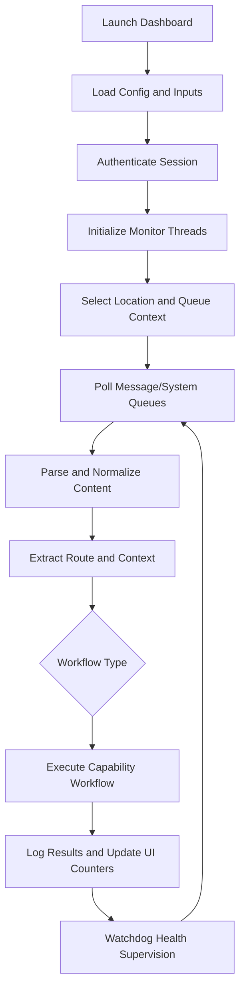
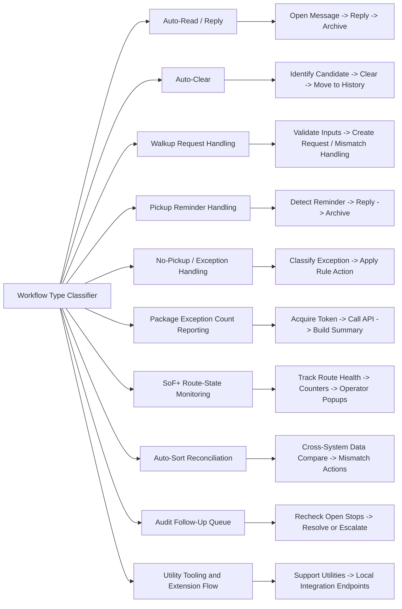
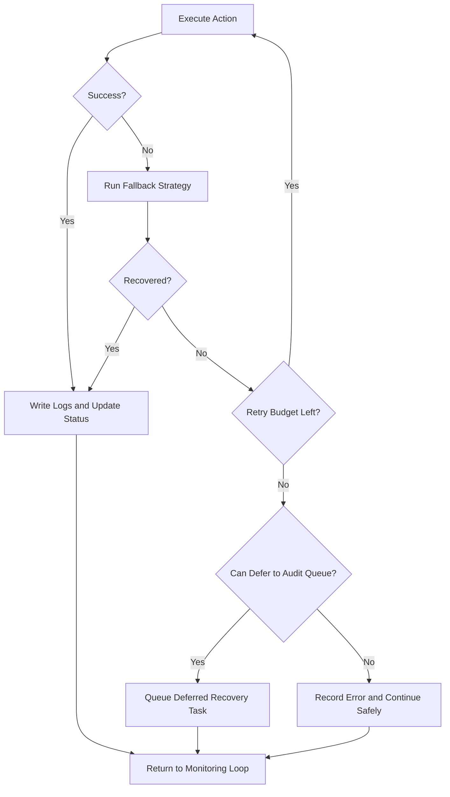

# ROUTR_SHOWCASE

Public-safe desktop automation platform for high-volume dispatch workflows.

> This repository is a sanitized technical showcase for code review and portfolio evaluation. It is intentionally non-runnable and excludes private integrations, credentials, internal endpoints, and production datasets.

## In 10 Seconds

**What is this?**  
`ROUTR_SHOWCASE` is a Python desktop application that automates repetitive dispatch operations using a CustomTkinter UI + Selenium workflow engine.

**What problem does it solve?**  
It reduces manual effort in route/message handling workflows where teams otherwise click through repetitive UI tasks, copy data, and process exceptions by hand.

**What tech is used?**  
Python, CustomTkinter/Tkinter, Selenium WebDriver, requests, pandas, threaded background workers, and structured logging/retry patterns.

**What’s the impact?**  
It standardizes operational execution, improves consistency, and helps teams process high-volume dispatch activity faster with fewer manual errors.

## Overview

This project demonstrates a custom-built automation platform designed to streamline high-volume dispatch operations.

The system replaces repetitive, manual workflows with structured automation logic, enabling faster processing, improved accuracy, and more consistent routing decisions.

Built using Python, Selenium, and CustomTkinter, the platform simulates real-world logistics automation while remaining fully sanitized for public demonstration.

## Key Capabilities

- Automated pickup classification and sorting based on predefined logic rules
- Dynamic route prioritization to optimize stop sequencing and dispatch efficiency
- Real-time GUI dashboard for monitoring and controlling dispatch workflows
- Browser automation using Selenium to replicate and execute repetitive operational tasks
- Data normalization and validation to ensure consistent processing of incoming pickup data
- Defensive fallbacks for dynamic web pages and transient UI failures
- Multi-location monitor orchestration (parallel Auto-Read, Auto-Clear, and SoF+ workers)
- Audit follow-up workflow for unresolved/open-stop routes
- Advanced auto-sort reconciliation workflow across operational and reporting systems
- Exception-count reporting workflow with API summary output
- Utility tooling (code generation workflows and extension-assisted integrations)

## Tech Stack

- Python
- Selenium WebDriver
- CustomTkinter / Tkinter
- requests
- pandas
- threading + structured logging

## Architecture Overview

- **UI Layer:** Desktop control panel and monitoring views using CustomTkinter/Tkinter
- **Automation Layer:** Selenium-based browser workflow engine for operational tasks
- **Data/Integration Layer:** API calls, parsing, validation, and action routing logic
- **Reliability Layer:** Retry loops, timeout guards, stale element recovery, and structured logging

```text
          ┌──────────────────────┐
          │     User Input       │
          │  (Dispatcher UI)     │
          └─────────┬────────────┘
                    │
                    ▼
          ┌──────────────────────┐
          │   Tkinter GUI Layer  │
          │  (Control Panel)     │
          └─────────┬────────────┘
                    │
                    ▼
          ┌──────────────────────┐
          │  Automation Engine   │
          │ (Selenium Workflows) │
          └─────────┬────────────┘
                    │
                    ▼
          ┌──────────────────────┐
          │   Data Processing    │
          │  (Parsing / Logic)   │
          └─────────┬────────────┘
                    │
                    ▼
          ┌──────────────────────┐
          │   Output / Actions   │
          │ (Routing Decisions)  │
          └──────────────────────┘
```

## Workflow Overview

1. Authenticate into an operational session (sanitized in public version)
2. Start selected monitor families (Auto-Read, Auto-Clear, SoF+, Reporting, Auto-Sort)
3. Monitor high-volume message/system queues and route-state signals
4. Extract route/context data and classify actionable items
5. Trigger automated actions (reply, clear, create, validate, reconcile)
6. Emit status logs/counters and keep watchdog-based self-healing active

## Process Flowchart



### Capability Branches



### Resilience and Recovery Flow



## Impact

- Replaced repetitive manual dispatch actions with automated workflows, reducing operational friction
- Improved routing consistency by enforcing structured decision logic across pickup handling
- Eliminated multi-step UI navigation and manual data entry through Selenium-based automation
- Increased throughput by enabling faster pickup processing and prioritization
- Reduced human error in dispatch coordination by standardizing execution paths

## Proof of Work

### Code Evidence

- `ROUTR_SHOWCASE.py` contains end-to-end UI, workflow, and automation orchestration.
- The structure demonstrates production-style defensive coding for real-world dynamic web flows.

### Visual Evidence

Screenshots and walkthrough clips are maintained separately to keep this repo focused on sanitized technical artifacts.

### Case Study (Problem -> Solution -> Result)

**Problem**  
Dispatch workflows required repetitive manual processing, causing delays and inconsistency.

**Solution**  
Built a Python automation platform with a desktop control UI and Selenium-driven workflow handling for route/message operations.

**Result**  
Faster execution, better operational consistency, and less manual overhead for recurring dispatch tasks.

## Project Structure

```text
ROUTR_SHOWCASE/
├── ROUTR_SHOWCASE.py
├── requirements.txt
├── screenshots/
└── README.md
```

## Public Safety / Sanitization

To make this repository safe for public visibility:

- Removed hardcoded API keys and moved config to environment variables
- Removed private access allowlists and internal identifiers
- Replaced internal production URLs with placeholders
- Replaced company/provider branding terms with neutral placeholders
- Excluded credentials, local logs, generated artifacts, and private datasets via `.gitignore`

## Notes

- This repository is intended for technical review.
- Enterprise integrations are anonymized/stubbed where needed for safe public sharing.
